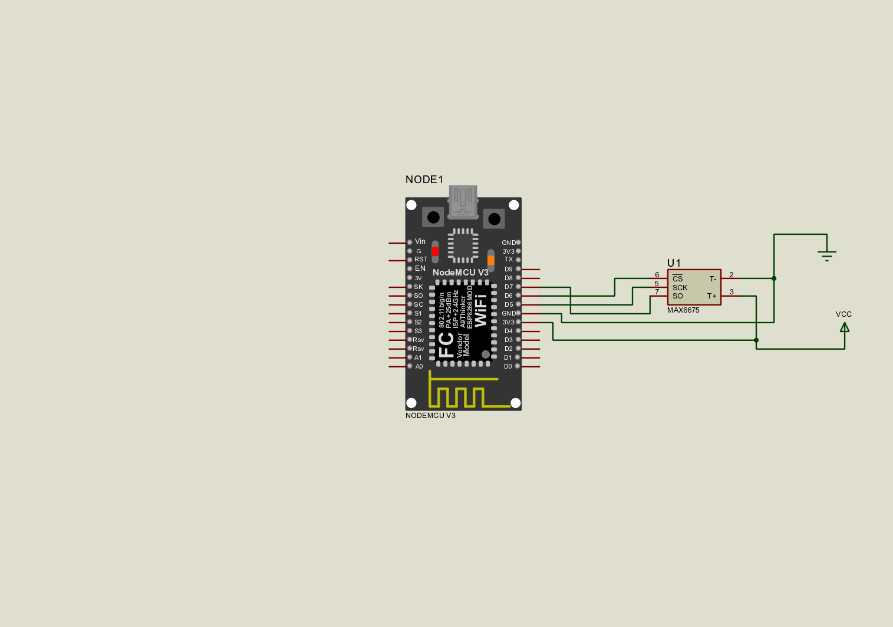

# Intefacing of temperature sensor MAX6675 with ESP8266 Node MCU

## Content
- 1.[Overview](#overview)
- 2.[Components Required](#components-reaquired)
- 3.[Project Flow](#project-flow)
- 4.[Circuit Diagram](#circuit-diagram)
- 5.[Summary](#summary)

## Overview
- This project is based on ESP8266 Node MCU

## Components Reaquired 
- ESP8266 Node MCU
- Temperature sensor
- USB cable
- Jumper Wire
- Bread Board

 ## Project Flow
  ### 1.Hardware Setup
  #### i.Gather Components
 - ESP8266 NodeMCU
 - Temperature Sensor MAX6675
 - Bread board & Jumper wire
 - USB cable
  
  #### ii.Hardware connectins
 - VCC of Temperature sensor to 3.3V of NodeMCU
 - Gnd of Temperature sensor to GND of NodeMCU
 - Connect Data pins of Temperature sensor to digital pins on NodeMCU
 - connect the NodeMCU to computrer thruough usb cable
   

 
  ### 2.Software Setup
  #### i. install Required ide
 - Install the VS code 
 - Install the platfomIO extention
 - Creat the new project
 - select the ESP8266 NodeMCU board
 - Install  required libraries

   
 #### ii.Thingspeak  Setup
 - open Thingspeak
 - Creat new channel
 - select  no of fields required
 - Add api key and and chnnel no in source code
 #### iii.Wifi Setup
 - Turn on the Wifi
 - Add SSID and passward in source code
 #### iv.Debbing & copiling
   - Debug & compile the code
   - Dump the code in Node MCU
   - Open the seril monitor to see the result
   - Wait untill the the NodeMCU connects to the wifi
   - after connected to the wifi open the thingspeak account
   - open your channel
  #### v.output
  -see output on thingspeak channel Field

 ## Circuit Diagram
 

 ## Summary
 To interface a temperature sensor MAX6675 with the ESP8266 NodeMCU and upload data to ThingSpeak, start by connecting the sensor VCC to the NodeMCU 3.3V pin, GND to GND, and Data to a digital pin Install the `ESP8266WiFi` and sensor libraries in the Arduino IDE. Write or upload code to read data from the sensor, connect to Wi-Fi, and send data to ThingSpeak using its API. Finally, compile and upload the code to the NodeMCU and monitor the uploaded data on the ThingSpeak channel.

